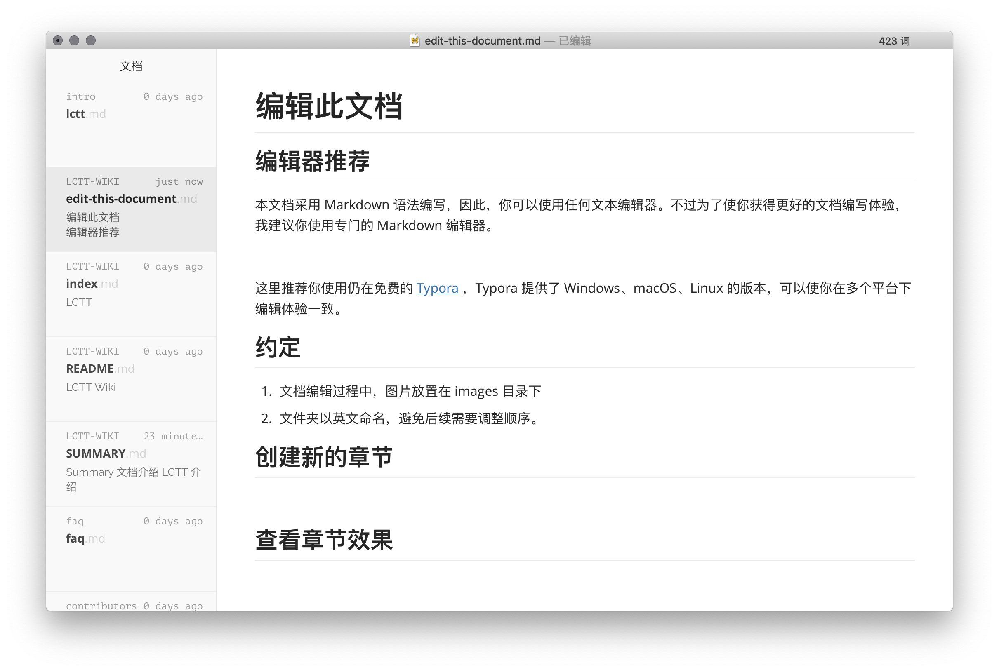
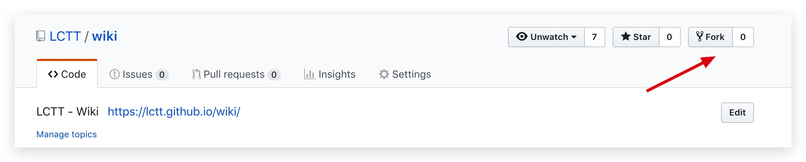

# 编辑此文档

## 编辑器推荐

本文档采用 Markdown 语法编写，因此，你可以使用任何文本编辑器。不过为了使你获得更好的文档编写体验，我建议你使用专门的 Markdown 编辑器。



这里推荐你使用仍在免费的 [Typora][1] ，Typora 提供了 Windows、macOS、Linux 的版本，可以使你在多个平台下编辑体验一致。

## 约定

1. 文档编辑过程中，图片放置在 images 目录下
2. 文件夹以英文命名，避免后续需要调整顺序。
3. 采用 PR 的模式进行协作，修改请先行 Fork。

## 创建新的章节

1. **创建目录**：在创建新的章节时，你需要先确保对应目录是否存在，如果不存在，则创建对应目录。

2. **创建文件**：若目录存在，文件不存在，则手动创建一个新的文件，将其放在对应目录中，并设置文件名。
3. **编辑内容**：修改你需要修改的文件的内容
4. **更新目录**：完成了内容的修改后，你需要对目录进行编辑，目录存放在 **SUMMARY.md** 文件中.


## 查看章节效果

Typora 为所见即所得模式的 Markdown 编辑器，你将主题切换为 **Github**（默认主题）时，其展示效果与 Github、Gitbook 所得效果基本一致，因此，你可以通过 Typora 预览，来实现对 Wiki 内容的预览。

## 提交你的修改

本项目采用 Pull Request 的模式进行协作。在贡献内容前，先将本仓库 Fork 到你自己的名下



Fork 后进行修改，修改完成后提交新的 PR ，等待内容的合并即可。

内容合并后，会自动构建新的站点版本。

## 自动构建新站点

本站采用的是 Travis CI 自动构建，因此，你无需手动构建最新版的电子书，手动推送到云端。**只需要你的修改被合并至 master 分支， Travis CI 就会自动构建最新版的电子书到线上**。

## 其他
### 安装 Gitbook （非必需）

本文档基于 Gitbook 构建，如果你希望在本地对电子书进行编译和通过网页预览，需要在本地安装 Gitbook。不过，如果你没有需求在本地预览网页，你就无需安装 Gitbook 了。

想要使用 Gitbook ，你需要先在自己的电脑上配置 Node.js 环境。在完成了 Node.js 环境的安装后，执行如下命令来安装 Gitbook

```shell
npm install gitbook-cli -g
```

安装完成后，在项目根目录执行如下命令，即可打开 gitbook 的预览模式。

```shell
gitbook serve
```

在项目根目录执行如下命令，即可构建 PDF 电子书

```shell
gitbook pdf output.pdf
```


[1]: https://typora.io/