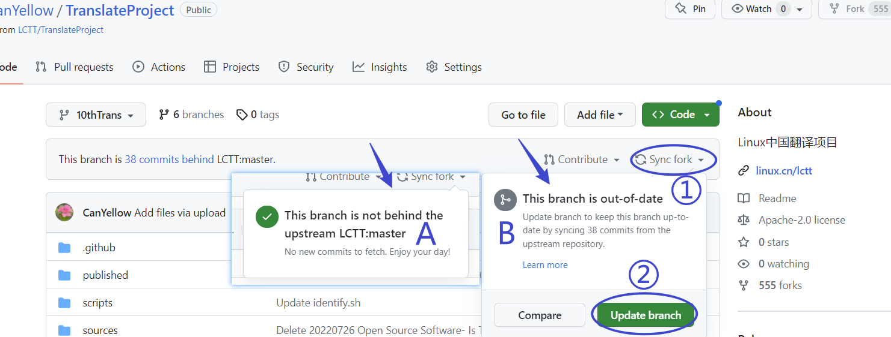

# 翻译流程示例

## 准备工作
在您正式进行LCTT的翻译工作之前，您需要完成一些基础的准备工作。这些工作至少包括GitHub账号注册、复刻LCTT主仓库到您的名下(复刻到您账户下的仓库副本后文将直接简称仓库副本)。当然我们也强烈建议您在准备投入LCTT的翻译工作前首先阅读本Wiki以理解本项目的一些基本原则与流程，这可以使您的翻译工作更加顺利高效。

1. 注册账号

如果您不是计算机行业从业者，您可能没有使用过GitHub，但本项目托管于GitHub上。因此在准备翻译之前，您需要访问[GitHub](https://github.com/)注册一个GitHub账号。

2. 复刻(Fork)主仓库

在您完成注册后，您可以使用您的账号登录GitHub并访问[LCTT项目的主仓库地址](https://github.com/LCTT/TranslateProject)。在该页面的右上角您将发现一个后面带有数字的“Fork”按钮(下图中1处)，您需要点击该按钮以在您的账户下创建一个本项目的副本。在执行完上述操作后，您可以依次点击下图中2、3处进入您的GitHub主页确认在您账户中是否已经存在本项目仓库的副本。

## 翻译流程

在您完成了以上准备工作后，您就可以着手进行正式翻译了。本项目的翻译流程分为申请、翻译、提交三个步骤。您可以按如下步骤操作。

### 翻译申请

由于本项目依赖团队协作，为了避免多人同时翻译同一篇文章造成的重复翻译问题。我们要求每一名译者在进行翻译之前，先就拟翻译的文章提出申请。提出申请的流程您可以参照如下步骤。

1. 在仓库副本中为本次翻译创建一个单独的分支。您可以在仓库副本的项目主页上按下图中的顺序操作。依次点击1、2，然后在转到的页面中点击3处来在弹出的窗口中创建分支。在弹出的分支中，您需要在4处输入您想创建的分支名称，并在5处切换为master分支，然后点击6创建即可。

需要注意的是，我们推荐您在创建分支时，一律将新创建的分支的源分支设为master，即在5处切换为master分支。因为master分支没有多余的提交记录，能够保证在后面提交翻译时，推送到主仓库的修改没有多余的提交历史。

2. 将主仓库的更改合并到您的仓库副本中。如果您是在进行上面的第一步后，立即进行下面的第三步，该步骤您可以跳过。但是如果您是在进行上面的第一步后，经过了一段时间再进行下面的第三步，那么在这段时间中，主仓库可能已经更新过了，推荐您先按步骤操作将主仓库的变更同步到您的仓库副本中。这是通过反向的推送(PR)实现的。具体如下。

在仓库副本的主页中点击下图1处进入推送页面，在推送页面中，点击2处创建新的推送，刷新出现3处所在的页面。在该项目中，后部为需要推送的内容，前部为推送到的目标。我们是需要将主仓库的变更推送到我们的仓库副本中，因此前部应当是5处的内容，即主仓库的master分支，后部为6处的内容，即本仓库副本的当前翻译的分支。在您切换5、6处的内容的时候，可能会出现4处下方的情况，即不显示仓库名称只显示分支名称，此时，您可以点击4处将仓库名称显示出来。您完成5、6处的选择后，点击7处提交推送申请。最后您需要在转到的页面中，点击8处将刚刚提交的推送合并到仓库副本的当前翻译分支中。如果有误，您也可以点击9处取消刚刚的推送。

3. 标记您想要翻译的文章。在仓库副本中，进入`.\source`目录，打开您想要翻译的文章，在文章头部的元数据中加入您的 GitHub ID，然后保存文件。具体而言，分以下几种情况：
* 有头部元信息(以`[#]`开头的行)：请在 `[#]: translator: " "` 中的 `" "` 中写入你的 GitHub ID；
* 没有头部信息：请在文章的头部加入 `你的_GitHub_ID translating`。

由于修改比较简单，你可以直接在网页上操作。如下图，保证1处已经切换到您刚刚创建的分支上，点击在您的文章右上角的2处的编辑按钮，文章将会以原格式重新显示，在原始格式的文章中，图中3处的引号内的内容若为空，您可以填入您的 GitHub ID。如果不为空，则已经被其他人认领，您可以选择其他文章进行翻译。

4. 将您的申请翻译的修改推送到主仓库。其基本过程与第2步相同，您只需要将其中5、6处的内容交换，即从仓库副本的当前翻译分支推送到主仓库的master分支中。在转到的页面中，您没有权限继续进行8、9处的操作，只需要在8处的上方显示检查通过没有冲突就可以了。您需要等待主仓库的管理员进行8处的操作同意合并您的翻译申请后，您就可以开始翻译了。

不过通常来说，只要您在推送时显示并无冲突、也稍后通过了 CI 检查，就可以自行翻译了，而不需要等待 PR 得到批准。每翻译一篇文章，都需要单独就此文章发起一个 PR。

我们强烈建议：请为每篇翻译的文章创建一个单独的分支，在此分支进行申请、翻译和提交译文，并等待最终译文进入了 LCTT TranslateProject 主仓库后，就可以安全地删除该分支。

### 进行翻译

由于翻译内容通常较长，一般难以一次翻译完成，我们推荐您的翻译工作在本地完成。这通常需要通过git客户端或者git命令行实现。

对于通过git客户端或者git命令行进行翻译操作的具体步骤，参见https://lctt.github.io/wiki/guide/translation_local.html

当然，如果您完全不熟悉git客户端以及git命令行，虽然我们不推荐，但是这里也有替代方案。见下图，在您在项目副本中打开想要翻译的文章后，会出现图中的页面，您可以点击图中的1处，这应当能将原始格式的文件下载到您本地电脑上。然后您可以在本地进行翻译，在翻译完成后，将同名的文件依次按图中2、3的顺序点击上传到translate目录的对应的文件夹中。

### 翻译提交

1. 同步主仓库的变更。按照翻译申请中第2步相同的步骤将主仓库的master分支的变更同步到您的仓库副本的您当前正在翻译的分支中。

2. 将您的翻译推送到主仓库。按照翻译申请中第4步相同的步骤将您的项目副本的当前翻译的分支推送到主仓库的master分支中。
