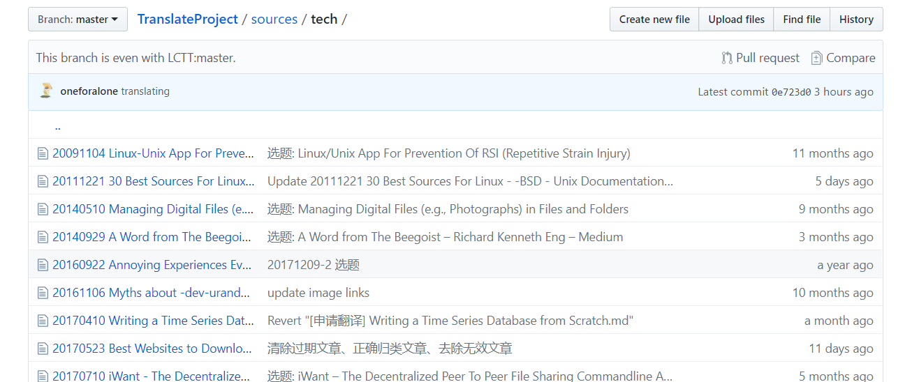
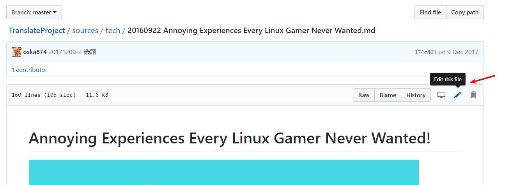
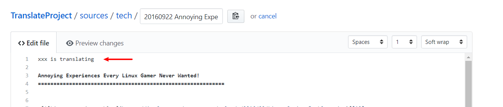
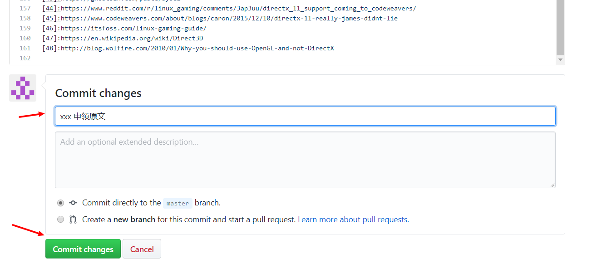
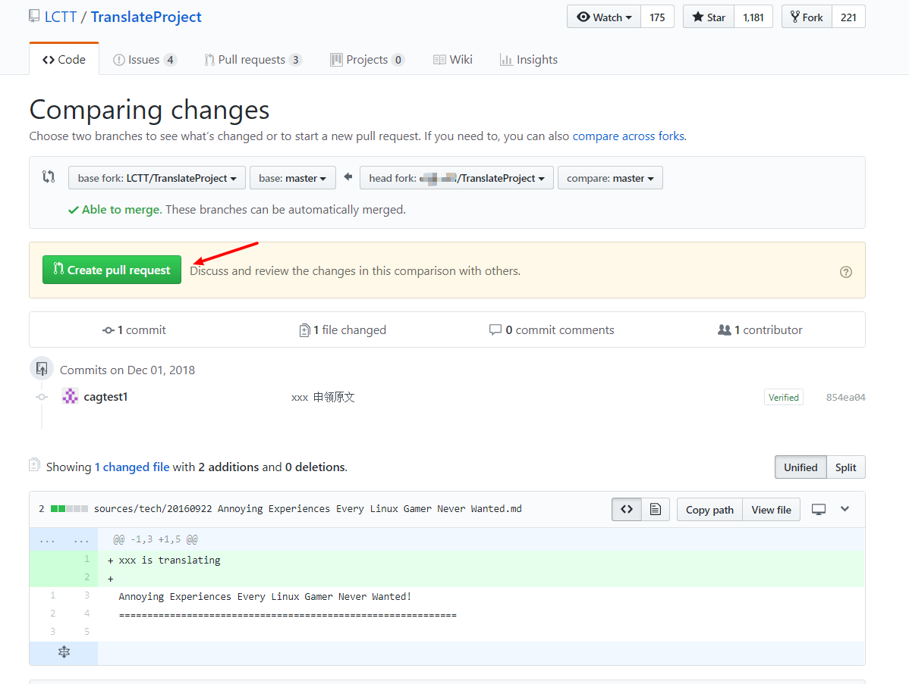
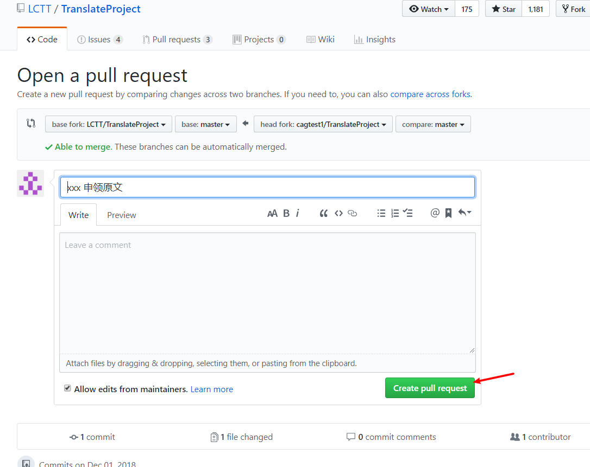
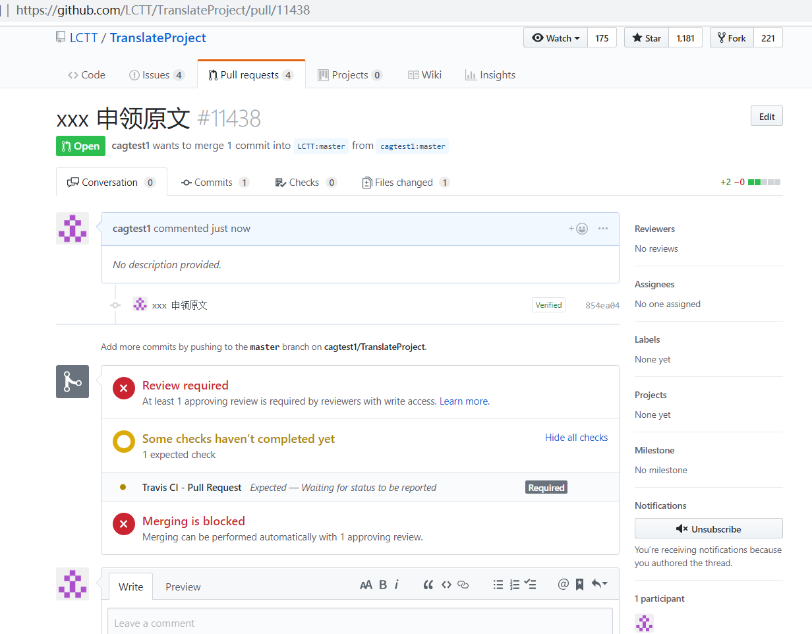

# web

在 web 上操作，步骤如下：

## fork LCTT 的主仓库

进入 LCTT 的仓库主页：https://github.com/LCTT/TranslateProject ，将仓库 **fork** 到自己名下。

成功后，你就有一个自己的 LCTT 文章库了，在这个仓库你可以进行任何操作，有问题大不了删掉重新 fork。

## 申领文章

进入你 fork 的 LCTT 代码库，挑选原文 `TranslateProject/sources/`，文章分两类：`talk` 和 `tech`，`talk` 的文章偏议论，`tech` 的文章都是技术干货。

进入子目录后，挑选一篇没有被人申领的文章。

编辑原文，在文章开始处写入 `xxx is translating`，表明改文已经被你申领，避免冲突。

最后，将你在自己的代码库进行的操作合并到 LCTT 的主仓库，提交 pull request 进行合并。

进入 `Pull request` 页面，创建一个 pull request。

一个 pull request 会包含你的 repo 当前的所有操作，只要和主 repo 不一样都会提交，所以希望你每完成一个操作 —— 申领原文、提交译文——就提交一次 pull request，在当前 pull request 没有被合并之前不要发起新的 pull request。

pull request 里面写好说明，指出你当前的操作是什么：申领原文、提交译文等。

操作成功，接下来就等待管理员合并你的 pull request，如果提交的 pull request 有问题，管理员会提醒你（GitHub 或者 QQ 群），然后再做修改重新发起 pull request。

## 提交翻译

翻译完成之后，修改原文内容为译文内容，并修改文末的译者 ID 为你的 GitHub ID，

提交译文的同时需要删除原文。这有两种操作方法：

* 在 `TranslateProject/translated/talk` 或 `TranslateProject/translated/tech`（和你申领的原文对应）创建新文件保存译文

    

    注意，操作过程中不要修改文件名。

    

    然后删除原文

    

* 修改原文，将译文内容保存到原文，步骤同上，先不要 commit，先在文件名框处定位到最开始处，使用退格键（backspace）删除全部 `/`。

    文件名处原来是这样的：

    

    删除掉 `/` 后是这样的：

    

    接下来修改路径为 `translated`:

    

    加上 `/`:

    

最后 commit，然后按照上一章节所述，提交译文的 pull request。

整个翻译的流程就如上所述，在实际操作中，如果遇到问题，欢迎在 GitHub 上面提交 issue，或者在 QQ 群提问。
