# 通过 Web 界面进行翻译

在 web 上操作，步骤如下：

## 准备工作

首先，你需要注册 [GitHub](https://github.com/)，具体步骤此处不赘述。

如果已有 GitHub 账户，请登录。

## 将 TranslateProject 的主仓库复刻到你名下

根据你是初次翻译还是已经进行过翻译，情况略有不同：

### 初次翻译

如果你尚未参与过本项目的翻译活动，请按如下步骤：

进入 LCTT 的仓库主页：[https://github.com/LCTT/TranslateProject](https://github.com/LCTT/TranslateProject) ，点击右上角的 “Fork” 按钮将仓库<ruby>复刻<rt>fork</rt></ruby>到自己名下。

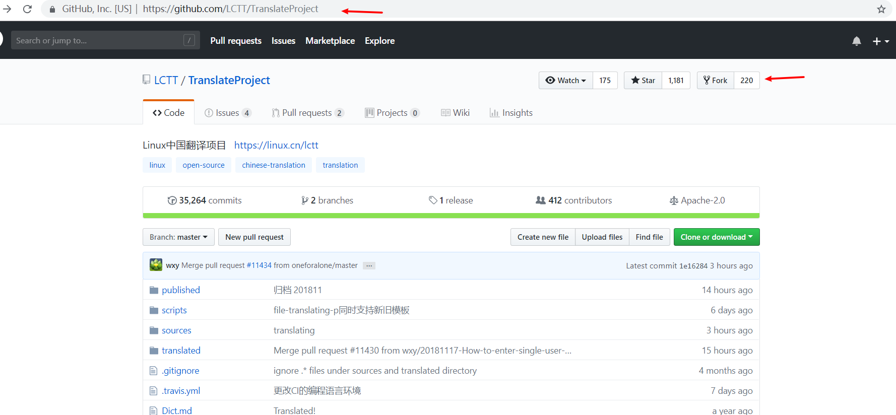

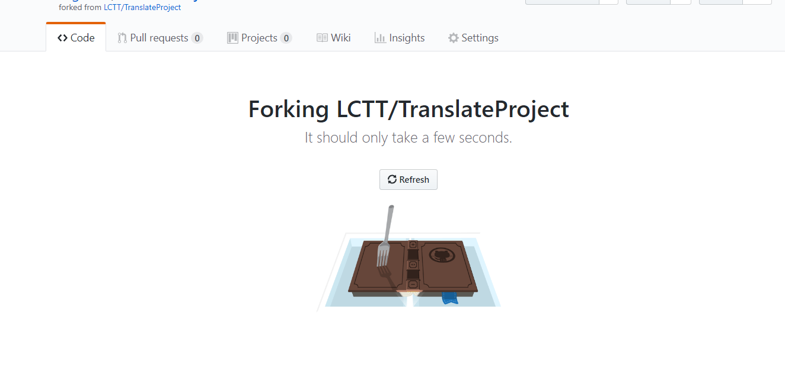

成功后，你就有一个自己的 TranslateProject 仓库了，在这个仓库你可以进行任何操作。在遇到棘手的问题时，你甚至可以删除掉你的这个本地仓库，重新复刻（如果你有任何需要保留的修改，请另行备份）。

### 再次翻译

如果你已经翻译过一篇或更多篇，你需要在再次翻译前确保你名下的仓库是更新的。在 GitHub 网站上是通过反向的 PR 进行的。

首先，访问你已经复刻到**你名下的仓库**。然后点击 “New pull request” 按钮：

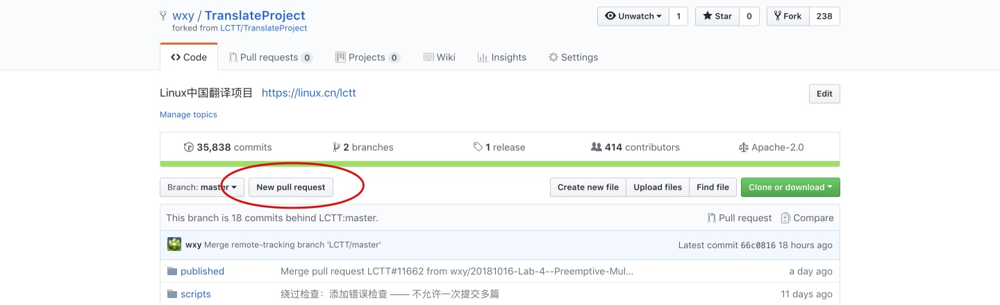

在显示 “Comaring changes” 页面，点击右侧如图所示的下拉菜单，选择 “LCTT/TranslateProject”：

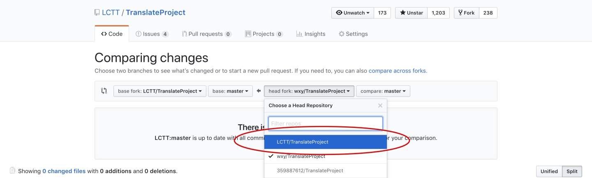

这时该页面会刷新，并显示没有差异，请点击右上角的 “compare cross forks” 链接：

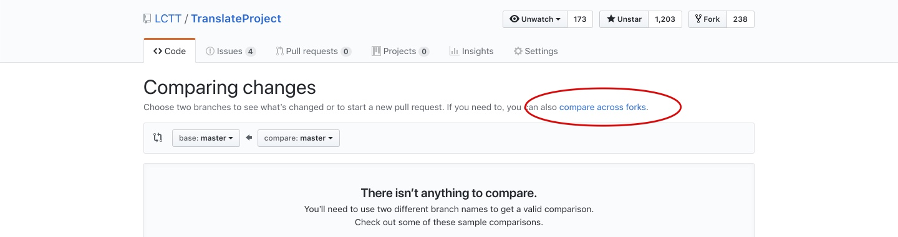

点击后，会重新出现下拉菜单，在左侧如图所示的下拉列表中，选择你复刻的仓库名称：

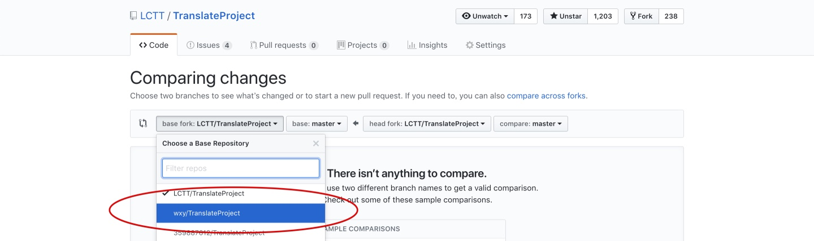

页面刷新后，会出现创建 PR 的页面，请点击 “Create new pull request” 按钮：

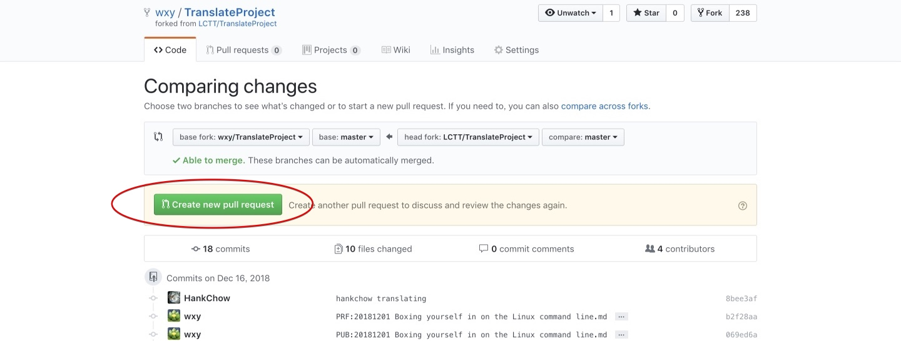

在出现的输入框中输入说明性文字，并点击 “Create pull request” 按钮：

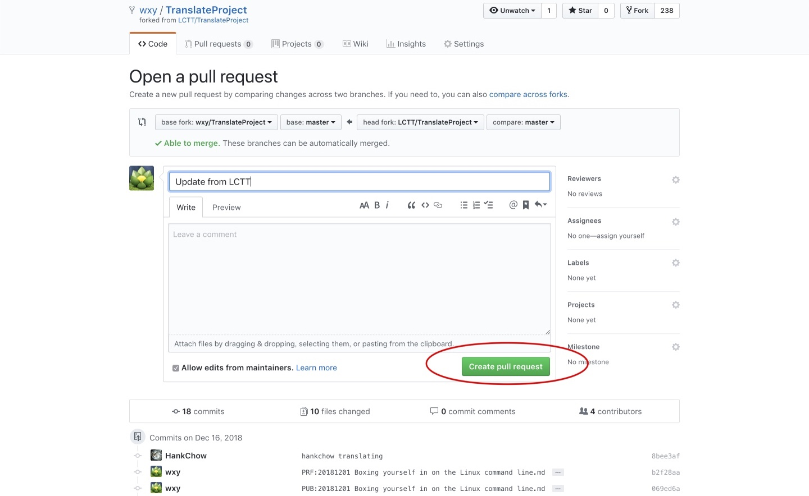

创建了 PR 之后，会直接显示一个页面，该 PR 可以直接合并，点击 “Merge pull request” 按钮从 LCTT 主仓库合并最新更新到你名下的仓库中：

这样，你名下的仓库就和 LCTT 的主仓库同步了，可以继续申请和翻译文章了。

## 翻译申请

进入你复刻的 LCTT 仓库，从 `sources` 目录中挑选你所喜欢，也擅长的文章。文章分两类：`talk` 和 `tech`，`talk` 的文章偏议论，`tech` 的文章都是技术干货。

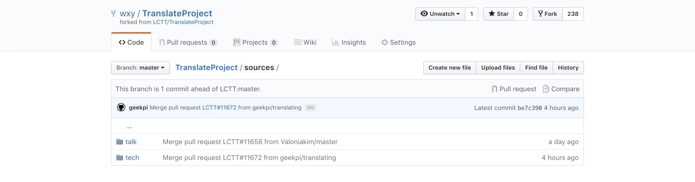

进入子目录后，点击一篇没有被人申领的文章。所有已被申领的文章的头部都应该有相应的申请信息。你也可以直接选择那些在列表中显示“选题：……”的信息——这些代表该文章选题后从未有人翻译过。

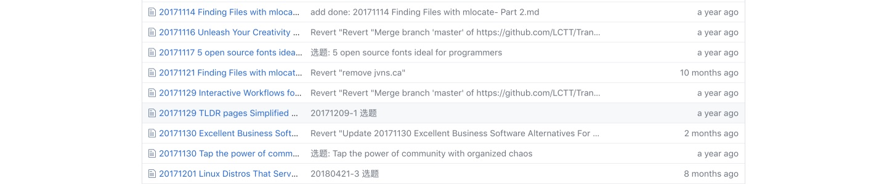

显示该文章内容后，如果是你所喜欢、内容难度也符合你的能力，请点击文章右上角的”铅笔“按钮，编辑该文章。

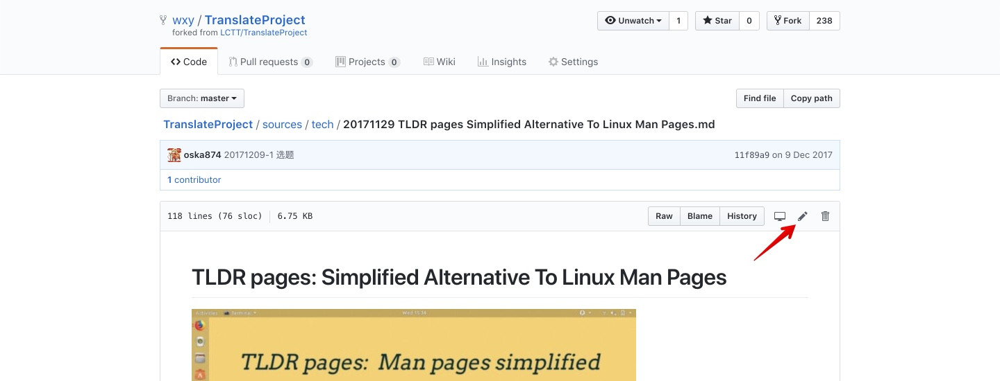

我们目前并存着两种文章模板：

- 没有头部元信息的旧模板：请在文章的头部加入 `你的_GitHub_ID is translating`。
- 有头部元信息的新模板：请修改头部元信息 `[#]: translator: ( )` 中的 `( )`，在其中写入你的 GitHub ID。

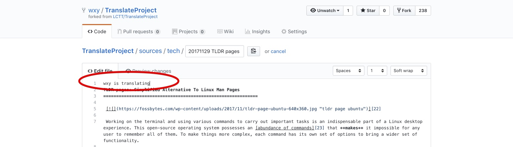

然后在页面底部的提交框输入相应的说明文字，并点击 “Commit changes” 来提交申请：

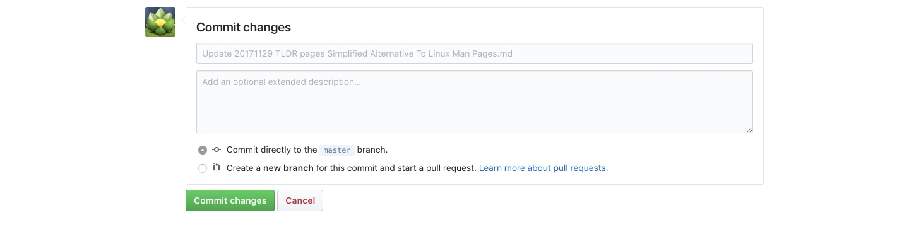

最后，回到你的仓库首页，点击 “New pull request” 按钮，将你在自己的代码库进行的操作合并到 LCTT 的主仓库，提交 PR。

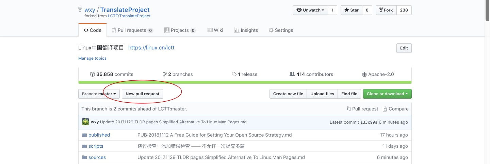

一个 PR 会包含你的仓库当前的所有操作，只要和主仓库不一样都会提交，所以，你每完成一个操作（申领原文、提交译文）就要提交一次 PR，在当前 PR 没有被合并之前不要发起新的 PR。

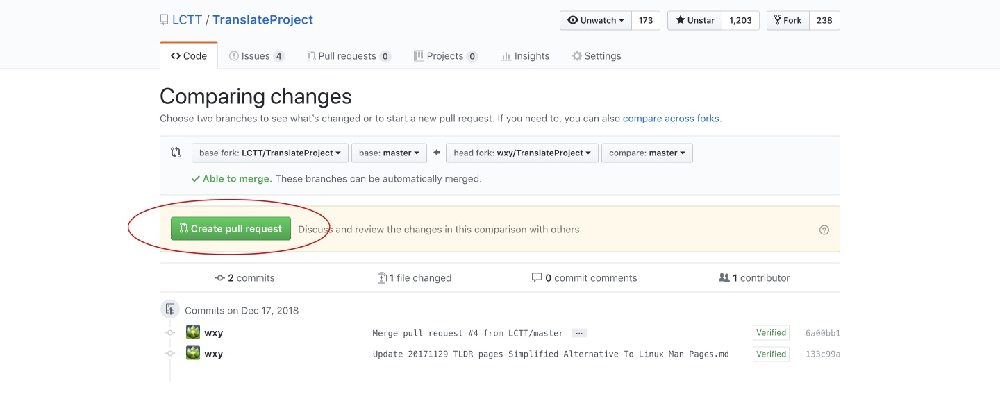

PR 里面写好说明，指出你当前的操作是什么：申领原文、提交译文等。

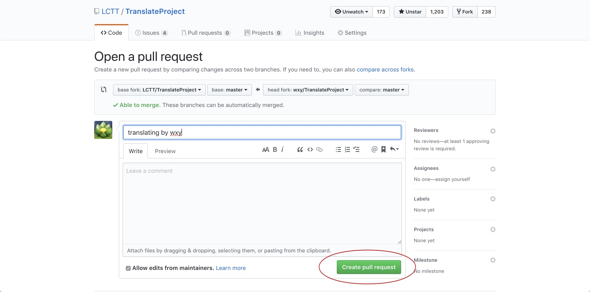

操作成功。这时你的 PR 正在进行 CI 检查是否合规。
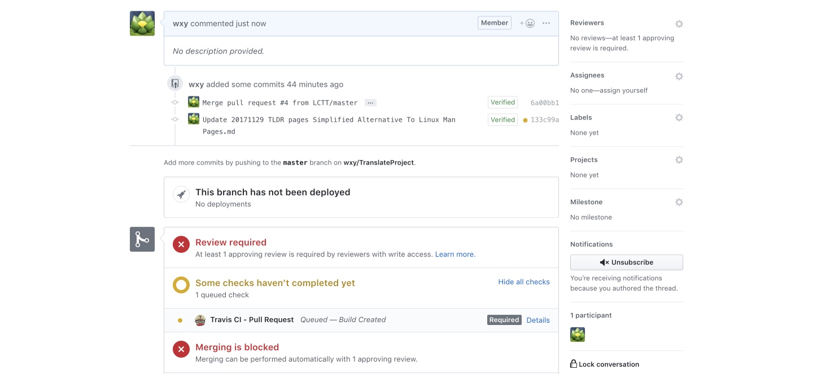

稍候片刻，CI 检查通过后，一般就可以等待管理员合并你的 PR。如果提交的 PR 有问题，管理员会提醒你（GitHub 通知或者 QQ 群），然后再做修改重新发起 PR。

然后，你就可以自行进行翻译了。

## 提交翻译

翻译完成之后，修改原文内容为译文内容，并修改文末的译者 ID 为你的 GitHub ID，

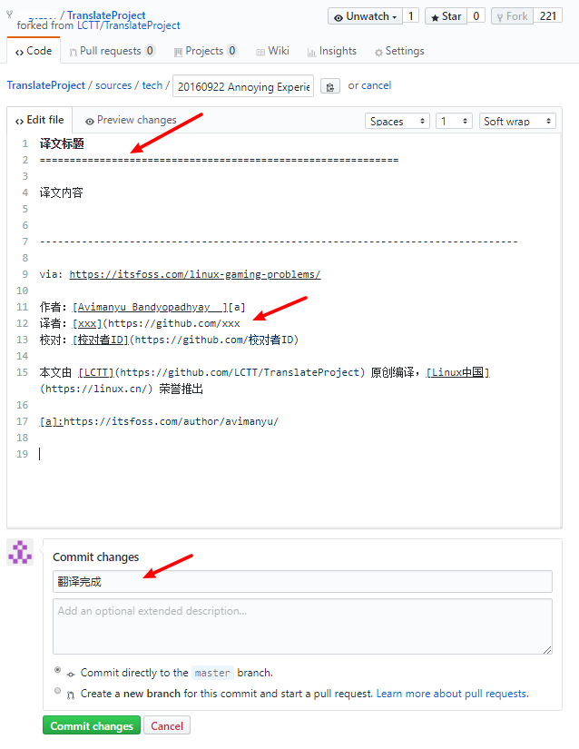

提交译文的同时需要删除原文。这有两种操作方法：

* 在 `TranslateProject/translated/talk` 或 `TranslateProject/translated/tech`（和你申领的原文对应）创建新文件保存译文

    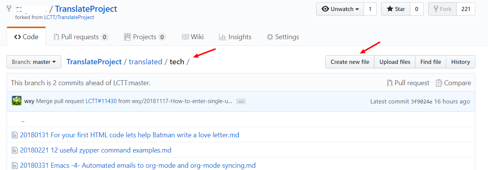

    注意，操作过程中不要修改文件名。

    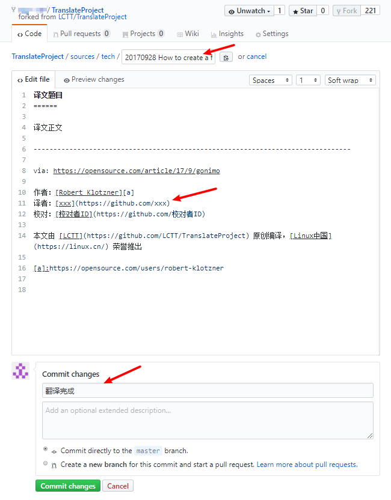

    然后删除原文

    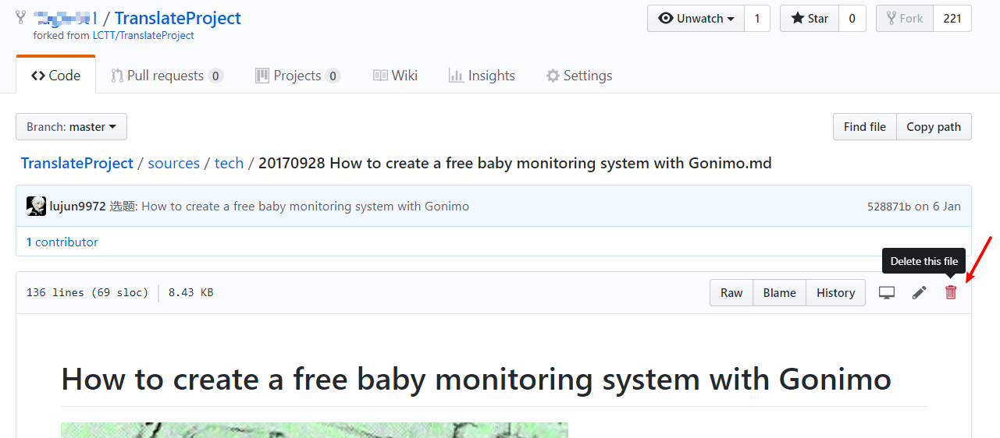

* 修改原文，将译文内容保存到原文，步骤同上，先不要 commit，先在文件名框处定位到最开始处，使用退格键（backspace）删除全部 `/`。

    文件名处原来是这样的：

    

    删除掉 `/` 后是这样的：

    

    接下来修改路径为 `translated`:

    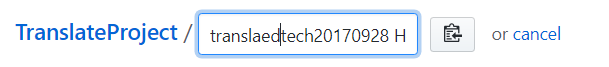

    加上 `/`:

    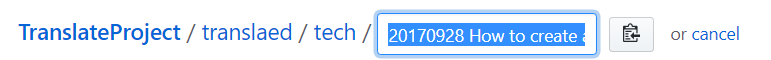

最后 commit，然后按照上一章节所述，提交译文的 pull request。

整个翻译的流程就如上所述，在实际操作中，如果遇到问题，欢迎在 GitHub 上面提交 issue，或者在 QQ 群提问。
