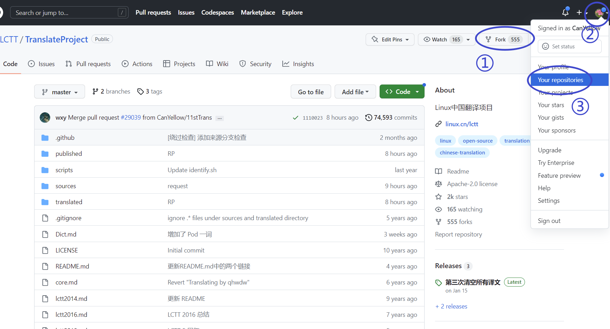
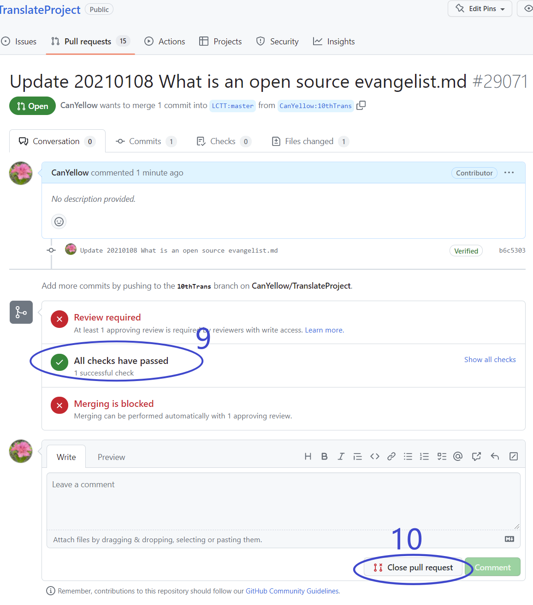
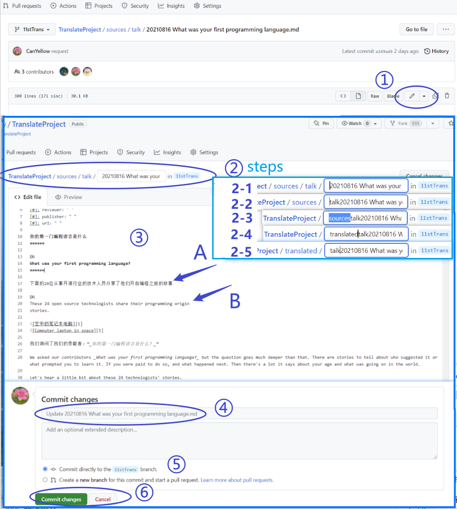
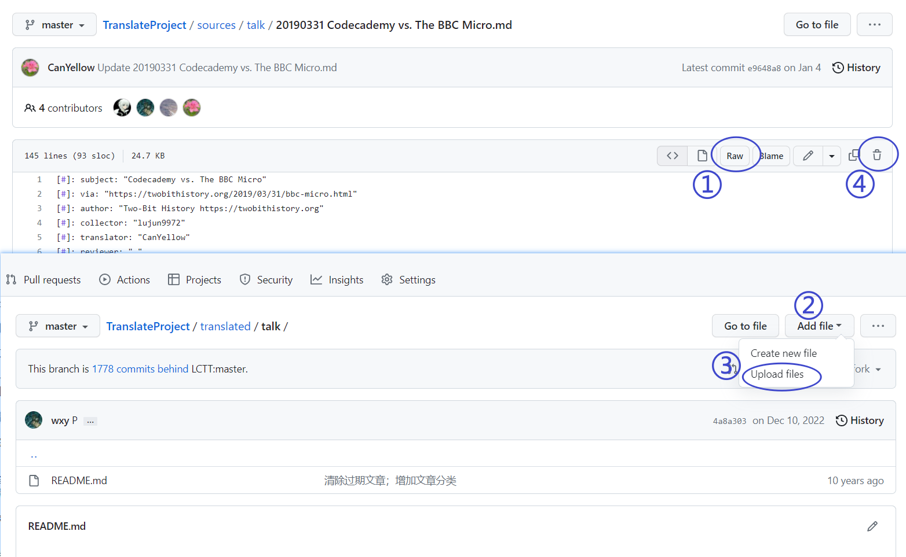

# 通过 Web 界面进行翻译

## 准备工作
在您初次进行LCTT的翻译工作之前，您需要完成一些基础的准备工作。这些工作至少包括GitHub账号注册、复刻LCTT主仓库到您的名下(复刻到您账户下的仓库副本后文将直接简称仓库副本)。当然我们也强烈建议您在准备投入LCTT的翻译工作前首先阅读本Wiki以理解本项目的一些基本原则与流程，这可以使您的翻译工作更加顺利高效。

1. 注册账号

如果您不是计算机行业从业者，您可能没有使用过GitHub，但本项目托管于GitHub上。因此在准备翻译之前，您需要访问[GitHub](https://github.com/)注册一个GitHub账号。

2. 复刻主仓库

在您完成注册后，您可以使用您的账号登录GitHub并访问[LCTT项目的主仓库地址](https://github.com/LCTT/TranslateProject)。在该页面的右上角您将发现一个后面带有数字的`Fork`按钮(下图中1处)，您需要点击该按钮以将本仓库<ruby>复刻<rt>fork</rt></ruby>到您的账户下。在执行完上述操作后，您可以依次点击下图中2、3处进入您的GitHub主页确认在您账户中是否已经存在仓库副本。

成功后，你就有一个自己的 TranslateProject 仓库了，在这个仓库你可以进行任何操作。在遇到棘手的问题时，你甚至可以删除掉你的这个本地仓库，重新复刻（如果你有任何需要保留的修改，请另行备份）。

## 翻译流程

在您完成了以上准备工作后，您就可以着手进行正式翻译了。本项目的翻译流程分为申请、翻译、提交三个步骤。您可以按如下步骤操作。

### 翻译申请

由于本项目依赖团队协作，为了避免多人同时翻译同一篇文章造成的重复翻译问题。我们要求每一名译者在进行翻译之前，先就拟翻译的文章提出申请。提出申请的流程您可以参照如下步骤。

1. 在您创建的仓库副本中**为本次翻译创建一个单独的<ruby>分支<rt>branch</rt></ruby>**(该分支在后文中称为当前翻译分支)

您可以在仓库副本的主页上按下图的顺序操作。依次点击1、2，然后在转到的页面中点击3处来在弹出的窗口中创建分支。在弹出的分支中，您需要在4处输入您想创建的分支名称，并在5处将父分支切换为master分支，然后点击6创建即可。

需要注意的是，我们推荐您在创建分支时，**一律将新创建的分支的父分支设为master**，即在5处切换为master分支。因为master分支没有多余的提交记录，能够保证在后面提交翻译时，推送到主仓库的修改没有多余的提交历史。

2. 将主仓库的更改合并到您的仓库副本中

如果您是在进行上面的第一步后，立即进行下面的第三步，该步骤您可以跳过。但是如果您是在进行上面的第一步后，经过了一段时间再进行下面的第三步，那么在这段时间中，主仓库可能已经更新过了，推荐您先按步骤操作将主仓库的变更同步到您的仓库副本中。这是通过反向的<ruby>推送<rt>PR, pull request</rt></ruby>实现的。

Github 提供了通过反向推送进行同步的快捷操作。您只需要在下图中点击目录右上方的1处的同步按钮即可。如果点击按钮后，显示为A，主仓库的内容与您的仓库副本中当前翻译分支的内容是一致的，您不需要进行任何同步操作。如果点击按钮后，显示为B，您需要点击2处完成从主仓库的master分支向仓库副本中当前翻译分支的同步。

3. 标记您想要翻译的文章

在仓库副本中，进入`.\source`目录，在该目录以及其子目录中均为待翻译的文章，您可以浏览查看来确定您想要翻译的文章。编辑您想要翻译的文章，在文章头部的元数据中加入您的 GitHub ID，然后保存文件。具体而言，分以下几种情况：
* 有头部元信息的文章(以`[#]`开头的行)：请在 `[#]: translator: " "` 中的 `" "` 中写入你的 GitHub ID；
* 没有头部信息：请在文章的头部加入 `你的_GitHub_ID translating`。

由于修改比较简单，你可以直接在网页上操作。如下图，保证1处已经切换到您刚刚创建的当前翻译分支中，点击在您的文章右上角2处的编辑按钮，文章将会以可编辑状态重新显示，在文章的编辑区，图中3处的引号内的内容若为空，说明没有其他人认领翻译该文章，您可以填入您的 GitHub ID 来认领翻译该文章。如果不为空，则已经被其他人认领，您可以选择其他文章进行翻译。

您需要保存您上面对文章所做的修改，您需要在可编辑状态下，将页面滚动到底部，然后在页面底部的4处填入您本次修改文章的简要说明，勾选5处，然后点击6处保存您对文章的修改为当前翻译分支下的一次提交。

4. 将您的申请翻译的修改推送到主仓库

在仓库副本的主页中点击下图1处进入推送页面，在推送页面中，点击2处创建新的推送，此时页面刷新变为4、5、6所处的状态。您也可以在主页中点击3直接进入4、5、6所处的状态中。在该状态的页面中，后部的5处为需要推送的内容，前部的4处为推送到的目标。我们是需要将仓库副本中当前翻译分支的变更推送到 LCTT 的主仓库的master分支中，因此5处应当填入仓库副本的当前翻译分支，4处应当填入主仓库的master分支。您可以点击4、5处的对应复选框然后在下拉菜单中选择正确的内容。在您切换4、5处的内容的时候，可能会出现不显示仓库名称只显示分支名称的情况，此时，您可以点击6-1处将仓库名称显示出来。您正确的完成4、5处的选择后，点击6处提交推送申请，在刷新的页面中的7处输入本次推送的说明，点击8处确认提交推送申请，这意味着您成功提交了一个将仓库副本中当前翻译分支的变更合并到LCTT的主仓库的master分支的推送申请。

最后在接下来转到的页面中，如果等待检查结束后，9处显示通过检查，说明您的推送没有问题，等待主主仓库的管理员同意合并您的翻译申请后，该推送就可以合并进主仓库的master分支了。您就可以开始翻译了。

不过通常来说，只要您在推送时显示并无冲突、也稍后通过了9处的 CI 检查，基本意味着您的翻译申请不存在与他人的翻译申请重复的情况，您就可以自行翻译了，而不需要等待 PR 得到批准。每翻译一篇文章，都需要单独就此文章发起一个上面的修改头部译者ID的 PR以提出您的翻译申请。

我们强烈建议：**请为每篇翻译的文章创建一个单独的分支**，在此分支进行申请、翻译和提交译文。在最终译文进入了 LCTT TranslateProject 主仓库后，就可以安全地删除该分支。

### 进行翻译

由于翻译内容通常较长，一般难以一次翻译完成，我们推荐您的翻译工作在本地完成。这通常需要通过git客户端或者git命令行实现。

对于通过git客户端或者git命令行进行翻译操作的具体步骤，参见https://lctt.github.io/wiki/guide/translation_local.html

当然，如果您完全不熟悉git客户端以及git命令行，您可以直接在 Web 界面中进行翻译。至少存在两种可选的方式：完全在 Web 页面中操作和部分在 Web 页面中操作。

#### 完全在 Web 页面中操作

1. 翻译文章

在你的仓库副本的当前翻译分支中浏览找到您已经申领翻译的文章，直接在网页上编辑该文章，进入编辑状态的过程与申请翻译中的标记翻译文章的操作过程是基本相同的，您可以互相参考。具体的过程如下图。

点击您需要翻译的文章后会进入显示该文章的页面中，如图中显示1处的页面，在该页面中点击1处的编辑图标，该文章刷新后进入编辑状态。在编辑状态的编辑栏3中，您可以任意修改该文章。当然，您可以在编辑栏中录入翻译后的文字。

当您完成了目前的翻译工作需要离开时，同样需要滚动到页面底部，在4处输入修改说明，勾选5处，然后点击6处保存您的工作。文章较长时，您可以多次进入编辑状态将文章分多次逐步翻译完成。

您在翻译时需要注意以下翻译事项：
* 需要保留文章头部的元信息；
* 需要保持保持原文中的所有格式和 Markdown 标签；
* 译文需要符合[中文排版指北](https://lctt.github.io/wiki/tutorials/copywriting.html)；
* 需要在完成全文翻译后，至少进行一次完整的检查。

对于文章的检查过程，我们有一个经验流程，您可以参考，当然您也可以开发适合您自己的翻译检查方式。如下图所示，您可以在翻译过程中，按段保留原文B与译文A，在完成译文后，做最后检查时边对照原文检查边删除原文。

2. 移动文章

我们要求翻译完成后将同名的译文文件移动到`./translated`目录下。您可以参照上图的2处的步骤操作。您可以如2-1将光标移动到上图2中的路径中的文件名栏中，并将光标置于文件名起始处，按下`backspace`退格键，将删除路径中的分隔线；然后如2-2将光标移动到新的文件名的起始处，继续按下`backspace`退格键，删除路径中的分隔线；接着如2-3选中文件名中的`source`修改为`translated`；然后如2-4将光标移动到`translate`后方输入`/`，网页自动将`translated`识别为上级目录并吞掉输入的`/`；最后如2-5，将光标移动到`talk`后方输入`/`。以上完成文件路径的更改，即文件移动操作。您需要在更改路径后保存您的变更，即如上图所示，依次完成4、5、6处的操作保存变更，这与翻译文章时的保存过程是相同的。

#### 部分在 Web 页面中操作

虽然我们不推荐，但是这里也有替代方案。见下图，在您在项目副本的当前翻译分支中打开想要翻译的文章后，会出现图中的页面，您可以点击图中的1处，这应当能将原始格式的文件下载到您本地电脑上。然后您可以在本地进行翻译，在翻译完成后，再将同名的文件依次按图中2、3的顺序点击上传到translate目录的对应的文件夹中。最后进入原始文章的页面下，点击4处将原文删除。

### 翻译提交

1. 同步主仓库的变更。按照翻译申请中第2步相同的步骤将主仓库的master分支的变更同步到您的仓库副本的您当前正在翻译的分支中。

2. 将您的翻译推送到主仓库。按照翻译申请中第4步相同的步骤将您的项目副本的当前翻译的分支推送到主仓库的master分支中。
