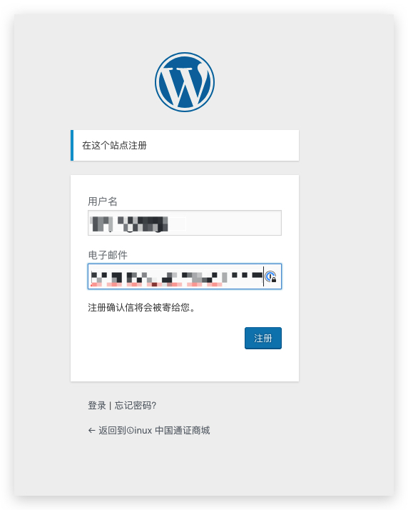
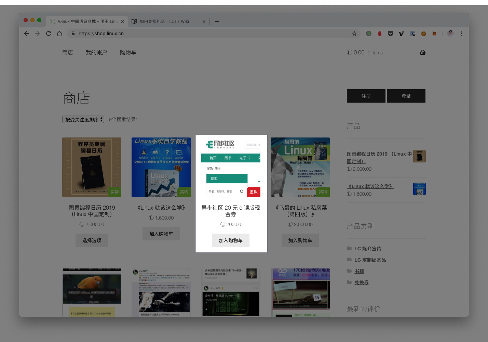
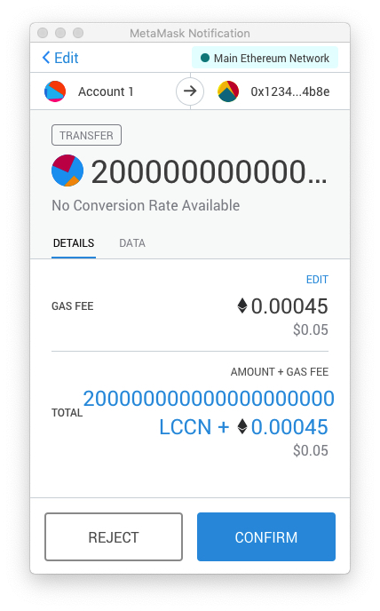
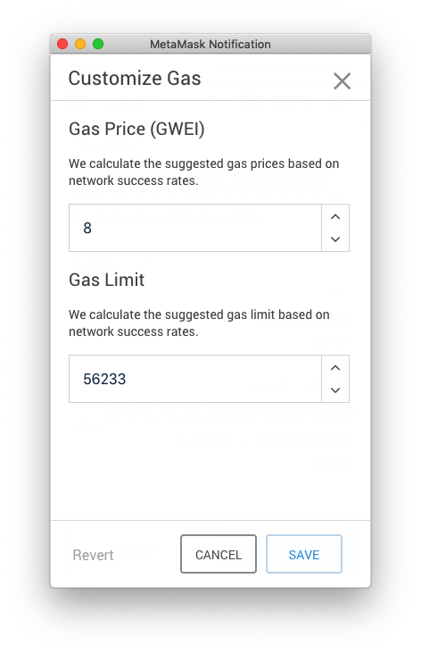

# 如何兑换礼品

目前 LCTT 的礼品兑换需要使用 Token 来进行兑换，因此，要求你拥有一个  ETH 钱包，并且注册了 LCTT 激励平台。如果你还没有完成，请查看「[如何获取 LCCN](how-to-get-lccn.md)」部分的内容。

## 注册商城用户

访问 Linux 中国通证商城，点击界面右上角的「注册」，进入到注册的界面。在弹出的界面中填写你的用户名和电子邮件的地址。

稍等片刻，你会收到一封邮件，来确认你的用户名和密码。

点击设置的链接，即可设置你的用户密码，并使用该密码登录。

## 选购礼品

点击菜单栏中的「商店」，回到商店首页，找到你想要兑换的礼品，点击「加入购物车」。

选购完你需要的礼品后，点击右上角的购物车图标，可以看到你所选的商品。点击结算，进入到结算页面。

填写必要的收货信息，点击「使用 Token 完成支付」，会跳转到结算页面。

在结算页面向下拖动，可以找到「使用 Metamask 支付订单」，点击「打开 Metamask 支付」，会自动唤起 MetaMask 进行支付。

点击 GAS Fee 旁边的 EDIT ，可以修改交易的 Gas 价格，建议你将 Gas Price 设置为 8 。设置完成后，点击保存。

在结算页面点击 Confirm 来确认交易。点击后，**页面会自动进行刷新**。

当你看到这样的界面时，就说明你支付完成了。后续只要关注你的邮箱，等待后续的订单更新邮件即可。
