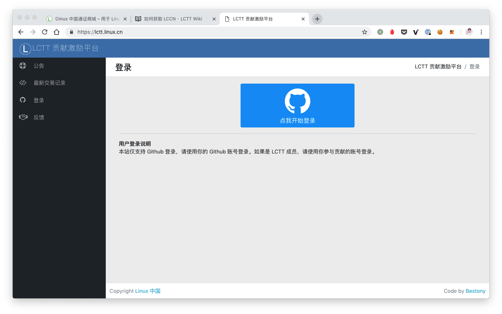
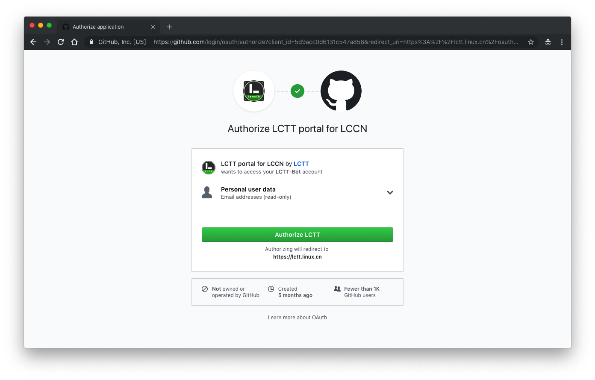
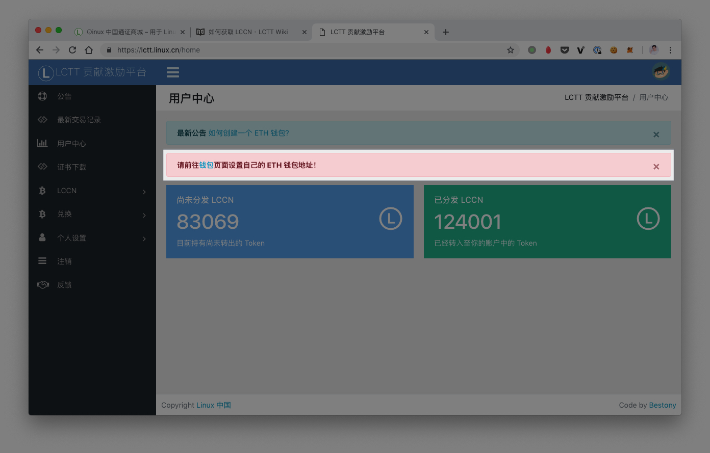
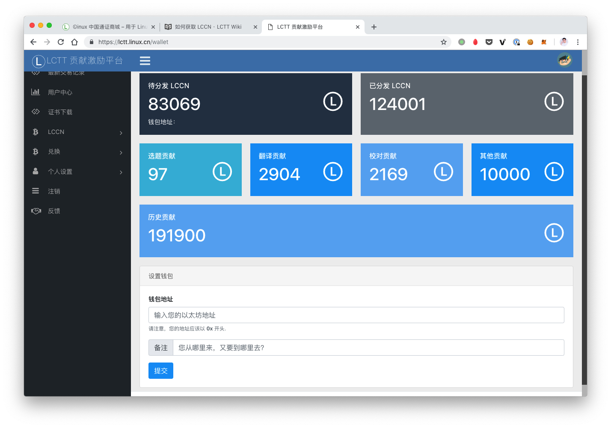
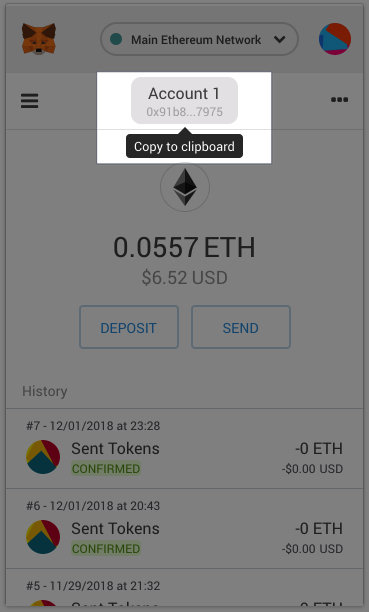
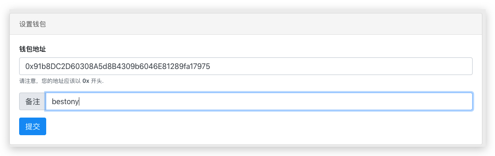
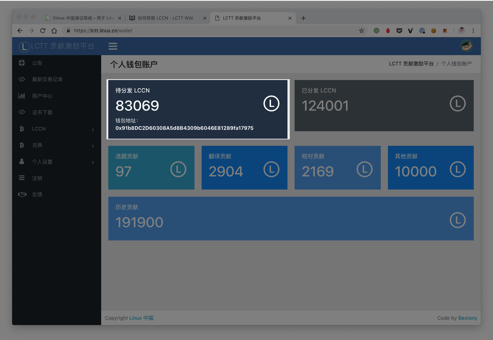

# 如何获取 LCCN

LCCN 是由 LCTT 发行的 ERC20 Token ，用以记录各位成员的贡献。你可以访问 [LCTT 贡献激励平台](https://lctt.linux.cn/) 登记你的 ERC20 钱包地址以获取对应的 LCCN（ERC20 钱包的创建请查看[如何创建一个ETH钱包](https://lctt.linux.cn/announcements/1)）。

LCTT 贡献激励平台地址：https://lctt.linux.cn/

## 注册用户

访问LCTT 贡献激励平台，点击界面上的登陆按钮，**使用你参与翻译活动的账号登陆进入平台**。

点击界面中的「钱包」链接，前往设置你自己的 ETH 钱包地址

在钱包页面你可以看到下面这样的界面

其中：

- **待分发 LCCN**：这个数字是指那些已经登记到你的名下，但尚未分发给你的 ETH 钱包账户的 Token 。此数字仅存在于平台内部，不被区块链所记录。
- **已分发 LCCN**：这个数字是指那些已经登记到你的名下，并且已经转账给你的 ETH 钱包的 Token 。此数字被区块链所记录。
- **选题贡献**：这里是指你在翻译流程中担任「选题」角色获得的 Token。
- **翻译贡献**：这里是指你在翻译流程中担任「译者」角色获得的 Token。
- **校对贡献**：这里是指你在翻译流程中担任「校对」角色获得的 Token。
- **其他贡献**：这里是指你参与 LCTT 其他活动时的贡献内容，比如参与微信群管理、社交账号的管理等。
- **历史贡献**：这个数字是指你还没有注册 LCTT 贡献激励平台时系统自动为你登记的 Token 。将会在你初次登陆时转账给你。**如果你曾翻译过文章，但这里没有对应的历史贡献，可以在 LCTT 翻译组群内私聊 wxy 或 Bestony 进行历史贡献的确认和结转**。

在该页面下方，你可以设置你自己的钱包地址，钱包地址可以从 Metamask 中获取（如果你不知道什么是 MetaMask ，请查看[如何创建一个ETH钱包](https://lctt.linux.cn/announcements/1)）。

在新版 Metamask 中，你可以在这里找到你的钱包地址。

找到钱包地址后，将其填入下方的设置框中，并在备注框内填入你的 Github 用户名，以关联你在 Github 上的信息，然后提交即可。

设置完成后，你可以在上方的界面中找到你的钱包地址。

接下来，你只需要等待平台定期的 Token 转账即可了。

## FAQ

1. **如何修改 ETH 钱包地址**

   答：暂未开放用户修改钱包地址的功能，因此，在输入时请注意。如果真的要修改。请在 LCTT 翻译群内联系 Bestony

2. **什么时候分发 Token**

   答：这个时间并不确定。如果你需要兑换礼品，可以在 LCTT 翻译群内联系 wxy，单独为你分发 Token。
